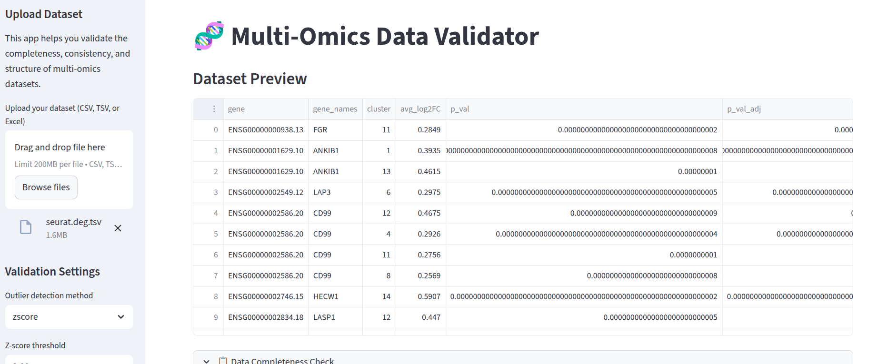
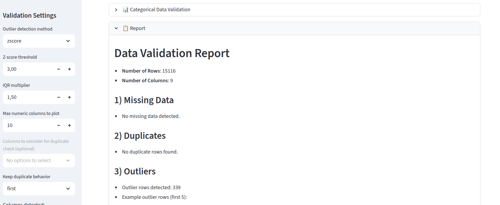

(meta_data_env) katiamerabet@katiamerabet-latitudee7450:~/Downloads/Meta_data_validation_tool$ cat README.md
# Multi-Omics Data Validator

An interactive **Streamlit web app** that validates the **completeness, consistency, and structure** of multi-omics datasets (genomics, proteomics, metabolomics, etc.).

This tool automatically checks your data for:
- Missing values  
- Duplicates  
- Outliers  
- Data consistency issues (e.g., negative values)  
- Categorical variable validation  
- Distributions and visualizations  

---

##  Motivation

This project was born from my interest in **bioinformatics data quality and reproducibility**.  
While exploring multi-omics analyses, I realized how much time researchers spend manually checking  
datasets for missing values, outliers, and inconsistencies before analysis.  
I developed this tool to **automate and standardize data validation**, helping researchers ensure  
their data is ready for integration and downstream modeling.

---

##  Features

- Upload your dataset in `.csv`, `.tsv`, or `.xlsx` format.  
- Automatically detects issues (missing data, duplicates, outliers).  
- Generates a **validation report** summarizing dataset quality.  
- Displays **visualizations** of numeric columns.  
- Ideal for **multi-omics quality control** and **data preprocessing** before analysis.

---

##  Example Use Case

This app can be used to validate data before:
- Multi-omics integration (e.g., transcriptomics + proteomics)
- Machine learning pipelines
- Statistical or differential expression analyses
- Data submission or publication QC

---

# Screenshots

Here are some screenshots:

<p align="center">
  
  
</p>
---

##  Installation

Clone the repository:
```bash
git clone https://github.com/katiamerabet/multiomics-data-validator.git
cd multiomics-data-validator